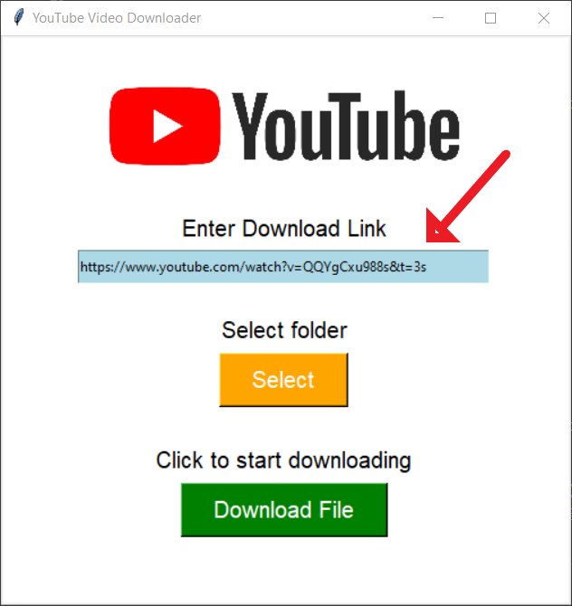
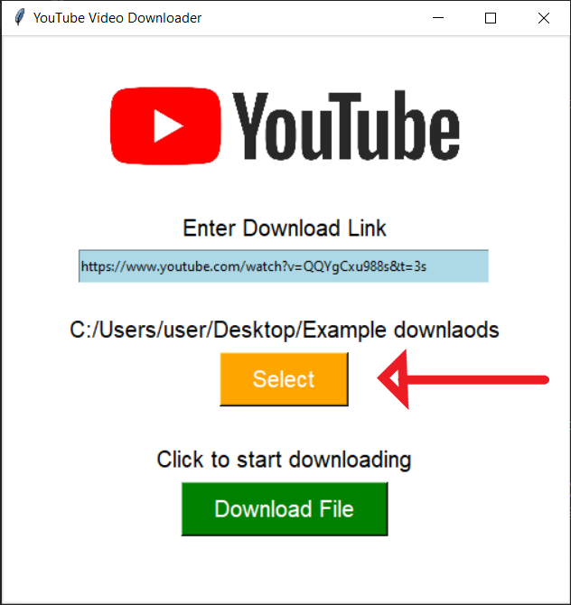
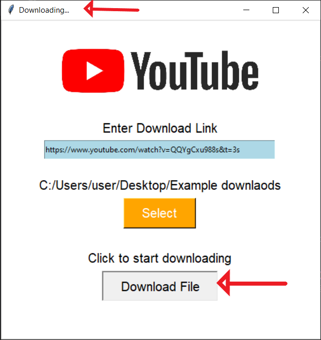
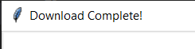
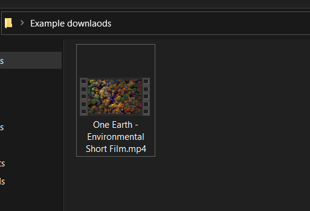

# YouTube-video-downloader
<!-- #### The basic GUI of the tool looks like this. -->
#### Paste the YouTube video link here.

#### Select where you want to download your video.

#### Click on "Download File" and downloading starts, and it'll also shown in the top left corner.

#### "Download Complete!" will be shown on the top left corner after the downlaod is complete.

#### Goto your selected folder and you'll find the video.

